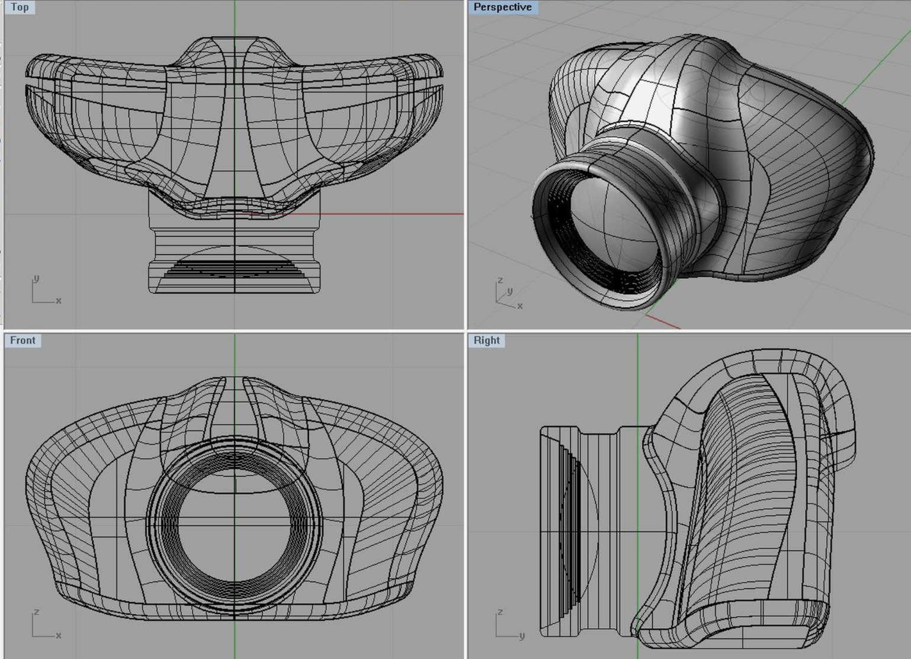
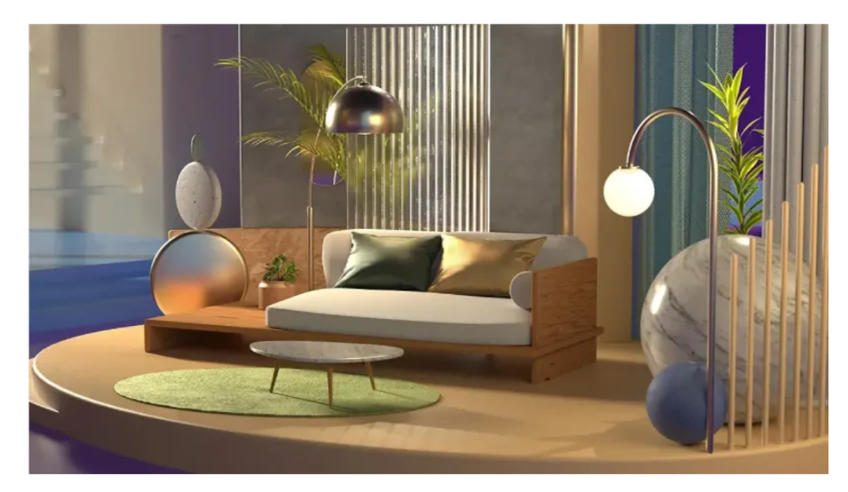

# Blok 3 – 3D grafika (Blender)

## Cíl

Chtěla jsem vytvořit 3D scénu představující menší rodinný dům se zahradou – rybníček s kapry koi, ohniště s lehátky a bazén se zeleninovou zahrádkou. Chtěla jsem utvořit příjemné prostředí pro rodinu i starší lidi v důchodu nebo snad jsako chata na kterou se každé léto těšíme.

---

## Postup

dům už jsem měla z předchozího projektu hotový takže stačilo přidat zahradu
na trávu jsem přidala obrázek trávy a dala na něj patickle system - hair, 10 000 particles, advanced, brownian 0.3
na rybníček jsem odstranila kus trávy a přidala další plochu kterou jsem udělala hnědou do tvaru misky, přidala jsem beziér curve - depth 0.1m - tím sem vyrobila stonek na lekníny které jsem pomocí edit modu upravila do požadovaného tvaru. květy leknínů jsem vytvořila pomocí plane (plochy) a v edit modu ji upravila, dala jsem lístek na lístek a duplikovala je, po zmanšení jsem vytvořila několik vrstev okvětních listů tvořící květ.
ryba byla složitá, pomocí sculpting modu jsem bojovala s každou křivkou, až později mi došlo že sculpting mode je velmi náročný na moji grafickou kartu. Nakonec jsem ale rybu dokončila a následně ji duplikovala. Duplikáty jsem zmenšila/zvětšila a umístila je na různá místa. každou rybu jsem potom zvlášť nabarvila abych nastínila diversitu a zakryla že jsou to prakticky identické duplikáty.

Renderoval jsem v Cycles, protože jsem chtěl realistické odrazy na skle. Trvalo to přibližně 8 minut na 512 vzorcích.

---

## Výstupy

- Soubor scény `kavarna.blend`
- Renderovaný výsledek:

- Render bez a se světly (srovnání):

---

## Reflexe

Jsem spokojený s výsledným osvětlením – teplé světlo z výlohy na dlažbě vypadá dobře. Modelování samotné bylo rychlejší, než jsem čekal. Co mi zabralo nejvíce času, bylo nastavení materiálu skla – průhlednost v Blenderu vyžaduje správné nastavení průhlednosti v render settings, jinak je sklo černé. Příště bych si scénu lépe naplánoval dopředu – přidával jsem objekty chaoticky a pak bylo těžké je v Outlineru najít, protože jsem je nepojmenoval.

---

## Teoretické pozadí (stručně)

3D objekty se skládají z vrcholů, hran a ploch (faces) – dohromady tvoří mesh. Tvar objektu upravuji v Edit Mode, kde pracuji přímo s geometrií. Materiály definují, jak povrch reaguje na světlo – použil jsem Principled BSDF, který kombinuje různé vlastnosti povrchu (barva, lesk, průhlednost). Renderování je výpočet výsledného obrazu ze 3D scény, přičemž Cycles simuluje fyzikálně korektní pohyb světelných paprsků. Podrobnosti v `teorie.md`.

---

## Zdroje

- [https://docs.blender.org/](https://docs.blender.org/) – dokumentace Blenderu
- [https://www.youtube.com/@blenderguru](https://www.youtube.com/@blenderguru) – Blender Guru, tutoriál na zátiší
- [https://polyhaven.com/](https://polyhaven.com/) – HDRI pro okolní osvětlení (CC0)
